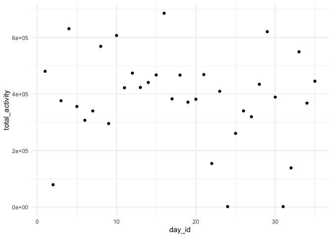

Data Science Homework 3
================
Kristina Howell

The following settings and libraries will be used throughout the
homework.

``` r
library(tidyverse)

theme_set(theme_minimal() + theme(legend.position = "bottom"))

options(
  ggplot2.continuous.colour = "viridis", 
  ggplot2.continuous.fill = "virirdis"
)

scale_colour_discrete = scale_color_viridis_d
scale_fill_discrete = scale_fill_viridis_d
```

## Problem 1

Load the datasets from the p8105 library.

``` r
library(p8105.datasets)
data("instacart")
```

#### Dataset Description

The dataset **instacart** contains information about specific orders
from the instacart online grocery service with 1,384,617 observations
from 131,209 unique users. Key variables in the dataset include
*department*, *aisle*, *product\_name*, and *order\_id*, as well as
various entries representing time, day of week, and days since prior
order.

Overall, the dataset contains 1384617 rows and 15 columns. Each row
represents an individual item ordered from a user. For example, the
first 8 rows represent:

  - the *order\_id* 1
  - from *user\_id* 112108
  - includes items from *department* “dairy eggs”, “produce”, and
    “canned goods”
  - featuring *product\_name* “Bulgarian Yogurt” ( *product\_id*: 49302
    ) and *product\_name* “Organic Celery Hearts” ( *product\_id*: 10246
    )

The **complete list of variables** in the dataset is as follows:
order\_id, product\_id, add\_to\_cart\_order, reordered, user\_id,
eval\_set, order\_number, order\_dow, order\_hour\_of\_day,
days\_since\_prior\_order, product\_name, aisle\_id, department\_id,
aisle, department.

#### Problem 1 Questions

##### How many aisles are there, and which aisles are the most items ordered from?

The first code chunk identifies the total number of aisles: 134.

``` r
instacart %>% 
  summarize(n_aisle = n_distinct(aisle_id))
```

    ## # A tibble: 1 x 1
    ##   n_aisle
    ##     <int>
    ## 1     134

The second code chunk creates a tibble listing the aisles and how much
they’re ordered from.

``` r
instacart %>% 
  group_by(aisle) %>% 
  summarize(n_ordered = n()) %>% 
  mutate(aisle_rank = min_rank(desc(n_ordered))) 
```

    ## `summarise()` ungrouping output (override with `.groups` argument)

    ## # A tibble: 134 x 3
    ##    aisle                  n_ordered aisle_rank
    ##    <chr>                      <int>      <int>
    ##  1 air fresheners candles      1067        109
    ##  2 asian foods                 7007         53
    ##  3 baby accessories             306        132
    ##  4 baby bath body care          328        131
    ##  5 baby food formula          13198         26
    ##  6 bakery desserts             1501         99
    ##  7 baking ingredients         13088         27
    ##  8 baking supplies decor       1094        106
    ##  9 beauty                       287        134
    ## 10 beers coolers               1839         90
    ## # … with 124 more rows

*Live lecture code*

``` r
instacart %>% 
  count(aisle) %>% 
  arrange(desc(n))
```

    ## # A tibble: 134 x 2
    ##    aisle                              n
    ##    <chr>                          <int>
    ##  1 fresh vegetables              150609
    ##  2 fresh fruits                  150473
    ##  3 packaged vegetables fruits     78493
    ##  4 yogurt                         55240
    ##  5 packaged cheese                41699
    ##  6 water seltzer sparkling water  36617
    ##  7 milk                           32644
    ##  8 chips pretzels                 31269
    ##  9 soy lactosefree                26240
    ## 10 bread                          23635
    ## # … with 124 more rows

##### Plot the number of items ordered in each aisle, limiting this to aisles with more than 10000 items ordered.

Continuing from the above code chunk,

*Live lecture code*

``` r
instacart %>% 
  count(aisle) %>% 
  arrange(desc(n)) %>% 
  filter(n >= 10000) %>% 
  mutate(
    aisle = factor(aisle),
    aisle = fct_reorder(aisle, n)
  ) %>% 
  ggplot(aes(x = aisle, y = n, color = aisle)) +
  geom_point() +
  theme(axis.text.x = element_text(angle = 90, vjust = 0.5, hjust = 1))
```

<!-- -->

##### Table showing the three most popular items in each of the aisles “baking ingredients”, “dog food care”, and “packaged vegetables fruits”.

*Live lecture code*

``` r
instacart %>% 
  filter(aisle %in% c( "baking ingredients", "dog food care", "packaged vegetables fruits")) %>% 
  group_by(aisle) %>% 
  count(product_name) %>% 
  mutate(rank = min_rank(desc(n))) %>% 
  filter(rank < 4) %>% 
  arrange(aisle, rank) %>% 
  knitr::kable()
```

| aisle                      | product\_name                                 |    n | rank |
| :------------------------- | :-------------------------------------------- | ---: | ---: |
| baking ingredients         | Light Brown Sugar                             |  499 |    1 |
| baking ingredients         | Pure Baking Soda                              |  387 |    2 |
| baking ingredients         | Cane Sugar                                    |  336 |    3 |
| dog food care              | Snack Sticks Chicken & Rice Recipe Dog Treats |   30 |    1 |
| dog food care              | Organix Chicken & Brown Rice Recipe           |   28 |    2 |
| dog food care              | Small Dog Biscuits                            |   26 |    3 |
| packaged vegetables fruits | Organic Baby Spinach                          | 9784 |    1 |
| packaged vegetables fruits | Organic Raspberries                           | 5546 |    2 |
| packaged vegetables fruits | Organic Blueberries                           | 4966 |    3 |

##### Table showing the mean hour of the day at which Pink Lady Apples and Coffee Ice Cream are ordered on each day of the week.

*Live lecture code*

``` r
instacart %>% 
  filter(product_name %in% c( "Pink Lady Apples", "Coffee Ice Cream")) %>% 
  group_by(product_name, order_dow) %>% 
  summarize(mean_hour = mean(order_hour_of_day)) %>% 
  pivot_wider(
    names_from = order_dow,
    values_from = mean_hour
  ) %>% 
  knitr::kable()
```

    ## `summarise()` regrouping output by 'product_name' (override with `.groups` argument)

| product\_name    |        0 |        1 |        2 |        3 |        4 |        5 |        6 |
| :--------------- | -------: | -------: | -------: | -------: | -------: | -------: | -------: |
| Coffee Ice Cream | 13.77419 | 14.31579 | 15.38095 | 15.31818 | 15.21739 | 12.26316 | 13.83333 |
| Pink Lady Apples | 13.44118 | 11.36000 | 11.70213 | 14.25000 | 11.55172 | 12.78431 | 11.93750 |

## Problem 2

Load in the dataset and tidy.

``` r
accel = read_csv("./data/accel_data.csv") %>% 
  janitor::clean_names() %>% 
  pivot_longer(
    activity_1:activity_1440,
    names_to = "time_minute",
    names_prefix = "activity_",
    values_to = "activity_count"
  ) %>% 
   mutate(
    week_day = case_when(
      day == "Monday" ~ "weekday", 
      day == "Tuesday" ~ "weekday", 
      day == "Wednesday" ~ "weekday", 
      day == "Thursday" ~ "weekday", 
      day == "Friday" ~ "weekday", 
      day == "Saturday" ~ "weekend",
      day == "Sunday" ~ "weekend",
      TRUE ~ ""
    ))
```

#### Dataset Description

The dataset **accel** contains activity collected from a 63 year old
male through an accelerometer. The activity data, noted in the
*activity\_count* variable, is recorded by minute, noted in the
*time\_minute* variable. These are then divided by day, recorded in the
*day\_id* variable, with the specific day of the week described in the
*day* variable. The dataset ranges from 1 - 5 weeks, as described in the
*week* variable. An additional variable, *week\_day* was created as a
binary character, denoting whether a particular day observation was a
weekday or weekend.

Overall, the dataset contains 50400 rows and 6 columns. Each row
represents an individual minute of each day.

#### Traditional Analyses

``` r
accel %>% 
  group_by(week, day) %>% 
  summarize(total_activity = sum(activity_count)) %>% 
  pivot_wider(
    names_from = day,
    values_from = total_activity
  ) %>% 
  relocate("week", "Monday", "Tuesday", "Wednesday", "Thursday", "Friday", "Saturday", "Sunday") %>% 
  knitr::kable(digits = 1)
```

    ## `summarise()` regrouping output by 'week' (override with `.groups` argument)

| week |   Monday |  Tuesday | Wednesday | Thursday |   Friday | Saturday | Sunday |
| ---: | -------: | -------: | --------: | -------: | -------: | -------: | -----: |
|    1 |  78828.1 | 307094.2 |    340115 | 355923.6 | 480542.6 |   376254 | 631105 |
|    2 | 295431.0 | 423245.0 |    440962 | 474048.0 | 568839.0 |   607175 | 422018 |
|    3 | 685910.0 | 381507.0 |    468869 | 371230.0 | 467420.0 |   382928 | 467052 |
|    4 | 409450.0 | 319568.0 |    434460 | 340291.0 | 154049.0 |     1440 | 260617 |
|    5 | 389080.0 | 367824.0 |    445366 | 549658.0 | 620860.0 |     1440 | 138421 |

Idk trends?

#### Plot

``` r
accel %>% 
  group_by(day_id) %>% 
  summarize(total_activity = sum(activity_count)) %>% 
  ggplot(aes(x = day_id, y = total_activity)) +
  geom_point()
```

    ## `summarise()` ungrouping output (override with `.groups` argument)

<!-- -->

## Problem 3

Load in the dataset and tidy.

``` r
library(p8105.datasets)
data("ny_noaa")
```

#### Dataset Description

The dataset **instacart** contains information about specific orders
from the instacart online grocery service with 1,384,617 observations
from 131,209 unique users. Key variables in the dataset include
*department*, *aisle*, *product\_name*, and *order\_id*, as well as
various entries representing time, day of week, and days since prior
order.

Overall, the dataset contains 1384617 rows and 15 columns. Each column
represents an individual item ordered from a user. For example, the
first 8 rows represent:

#### Problem 3 Questions

##### Do some data cleaning. Create separate variables for year, month, and day. Ensure observations for temperature, precipitation, and snowfall are given in reasonable units. For snowfall, what are the most commonly observed values? Why?

##### Make a two-panel plot showing the average max temperature in January and in July in each station across years. Is there any observable / interpretable structure? Any outliers?

##### Make a two-panel plot showing (i) tmax vs tmin for the full dataset (note that a scatterplot may not be the best option); and (ii) make a plot showing the distribution of snowfall values greater than 0 and less than 100 separately by year.
