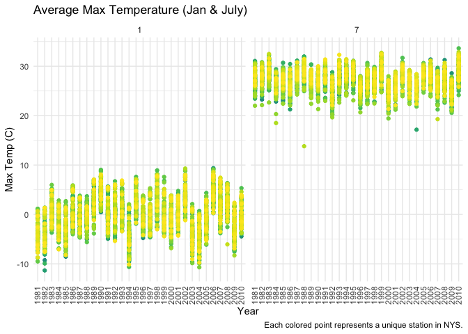

Data Science Homework 3
================
Kristina Howell

The following settings and libraries will be used throughout the
homework.

``` r
library(tidyverse)
library(ggplot2)
library(ggridges)
library(patchwork)
library(hexbin)

theme_set(theme_minimal() + theme(legend.position = "bottom"))

options(
  ggplot2.continuous.colour = "viridis", 
  ggplot2.continuous.fill = "viridis"
)

scale_colour_discrete = scale_color_viridis_d
scale_fill_discrete = scale_fill_viridis_d
```

## Problem 1

Load the datasets from the p8105 library.

``` r
library(p8105.datasets)
data("instacart")
```

#### Dataset Description

The dataset **instacart** contains information about specific orders
from the instacart online grocery service with 1,384,617 observations
from 131,209 unique users. Key variables in the dataset include
*department*, *aisle*, *product\_name*, and *order\_id*, as well as
various entries representing time, day of week, and days since prior
order.

Overall, the dataset contains 1384617 rows and 15 columns. Each row
represents an individual item ordered from a user. For example, the
first 8 rows represent:

  - the *order\_id* 1
  - from *user\_id* 112108
  - includes items from *department* “dairy eggs”, “produce”, and
    “canned goods”
  - featuring *product\_name* “Bulgarian Yogurt” ( *product\_id*: 49302
    ) and *product\_name* “Organic Celery Hearts” ( *product\_id*: 10246
    )

The **complete list of variables** in the dataset is as follows:
order\_id, product\_id, add\_to\_cart\_order, reordered, user\_id,
eval\_set, order\_number, order\_dow, order\_hour\_of\_day,
days\_since\_prior\_order, product\_name, aisle\_id, department\_id,
aisle, department.

#### Problem 1 Questions

##### How many aisles are there, and which aisles are the most items ordered from?

The first code chunk identifies the total number of aisles: 134.

``` r
instacart %>% 
  summarize(n_aisle = n_distinct(aisle_id))
```

    ## # A tibble: 1 x 1
    ##   n_aisle
    ##     <int>
    ## 1     134

The second code chunk creates a tibble listing the aisles and how much
they’re ordered from.

``` r
instacart %>% 
  group_by(aisle) %>% 
  summarize(n_ordered = n()) %>% 
  mutate(aisle_rank = min_rank(desc(n_ordered))) 
```

    ## `summarise()` ungrouping output (override with `.groups` argument)

    ## # A tibble: 134 x 3
    ##    aisle                  n_ordered aisle_rank
    ##    <chr>                      <int>      <int>
    ##  1 air fresheners candles      1067        109
    ##  2 asian foods                 7007         53
    ##  3 baby accessories             306        132
    ##  4 baby bath body care          328        131
    ##  5 baby food formula          13198         26
    ##  6 bakery desserts             1501         99
    ##  7 baking ingredients         13088         27
    ##  8 baking supplies decor       1094        106
    ##  9 beauty                       287        134
    ## 10 beers coolers               1839         90
    ## # … with 124 more rows

*Live lecture code*

``` r
instacart %>% 
  count(aisle) %>% 
  arrange(desc(n))
```

    ## # A tibble: 134 x 2
    ##    aisle                              n
    ##    <chr>                          <int>
    ##  1 fresh vegetables              150609
    ##  2 fresh fruits                  150473
    ##  3 packaged vegetables fruits     78493
    ##  4 yogurt                         55240
    ##  5 packaged cheese                41699
    ##  6 water seltzer sparkling water  36617
    ##  7 milk                           32644
    ##  8 chips pretzels                 31269
    ##  9 soy lactosefree                26240
    ## 10 bread                          23635
    ## # … with 124 more rows

##### Plot the number of items ordered in each aisle, limiting this to aisles with more than 10000 items ordered.

Continuing from the above code chunk,

*Live lecture code*

``` r
instacart %>% 
  count(aisle) %>% 
  arrange(desc(n)) %>% 
  filter(n >= 10000) %>% 
  mutate(
    aisle = factor(aisle),
    aisle = fct_reorder(aisle, n)
  ) %>% 
  ggplot(aes(x = aisle, y = n, color = aisle)) +
  geom_point() +
  theme(axis.text.x = element_text(angle = 90, vjust = 0.5, hjust = 1))
```

<!-- -->

##### Table showing the three most popular items in each of the aisles “baking ingredients”, “dog food care”, and “packaged vegetables fruits”.

*Live lecture code*

``` r
instacart %>% 
  filter(aisle %in% c( "baking ingredients", "dog food care", "packaged vegetables fruits")) %>% 
  group_by(aisle) %>% 
  count(product_name) %>% 
  mutate(rank = min_rank(desc(n))) %>% 
  filter(rank < 4) %>% 
  arrange(aisle, rank) %>% 
  knitr::kable()
```

| aisle                      | product\_name                                 |    n | rank |
| :------------------------- | :-------------------------------------------- | ---: | ---: |
| baking ingredients         | Light Brown Sugar                             |  499 |    1 |
| baking ingredients         | Pure Baking Soda                              |  387 |    2 |
| baking ingredients         | Cane Sugar                                    |  336 |    3 |
| dog food care              | Snack Sticks Chicken & Rice Recipe Dog Treats |   30 |    1 |
| dog food care              | Organix Chicken & Brown Rice Recipe           |   28 |    2 |
| dog food care              | Small Dog Biscuits                            |   26 |    3 |
| packaged vegetables fruits | Organic Baby Spinach                          | 9784 |    1 |
| packaged vegetables fruits | Organic Raspberries                           | 5546 |    2 |
| packaged vegetables fruits | Organic Blueberries                           | 4966 |    3 |

##### Table showing the mean hour of the day at which Pink Lady Apples and Coffee Ice Cream are ordered on each day of the week.

*Live lecture code*

``` r
instacart %>% 
  filter(product_name %in% c( "Pink Lady Apples", "Coffee Ice Cream")) %>% 
  group_by(product_name, order_dow) %>% 
  summarize(mean_hour = mean(order_hour_of_day)) %>% 
  pivot_wider(
    names_from = order_dow,
    values_from = mean_hour
  ) %>% 
  knitr::kable()
```

    ## `summarise()` regrouping output by 'product_name' (override with `.groups` argument)

| product\_name    |        0 |        1 |        2 |        3 |        4 |        5 |        6 |
| :--------------- | -------: | -------: | -------: | -------: | -------: | -------: | -------: |
| Coffee Ice Cream | 13.77419 | 14.31579 | 15.38095 | 15.31818 | 15.21739 | 12.26316 | 13.83333 |
| Pink Lady Apples | 13.44118 | 11.36000 | 11.70213 | 14.25000 | 11.55172 | 12.78431 | 11.93750 |

## Problem 2

#### Load in the dataset and tidy

The data is imported through the read\_csv function from the tidyverse
library. The data cleaning steps include cleaning the names, through the
clean\_names() function in the janitor library, and reorganizing the
data to represent activity as a variable, using the pivot\_longer()
function. The time\_minute variable is then mutated into a numeric
variable. Therefore, all variables are numeric, except for day and
week\_day.

``` r
accel = read_csv("./data/accel_data.csv") %>% 
  janitor::clean_names() %>% 
  pivot_longer(
    activity_1:activity_1440,
    names_to = "time_minute",
    names_prefix = "activity_",
    values_to = "activity_count"
  ) %>% 
   mutate(
    week_day = case_when(
      day == "Monday" ~ "weekday", 
      day == "Tuesday" ~ "weekday", 
      day == "Wednesday" ~ "weekday", 
      day == "Thursday" ~ "weekday", 
      day == "Friday" ~ "weekday", 
      day == "Saturday" ~ "weekend",
      day == "Sunday" ~ "weekend",
      TRUE ~ ""
    )) %>% 
  mutate(time_minute = as.numeric(time_minute))
```

#### Dataset Description

The dataset **accel** contains activity collected from a 63 year old
male through an accelerometer. This data was collected due to an
admission to the Advanced Cardiac Care Center of Columbia University
Medical Center and subsequent diagnosis of congestive heart failure
(CHF).

The activity data ( *activity\_count* ) is recorded by minute (
*time\_minute* ). These are then divided by day ( *day\_id* ) with the
specific day of the week described in the *day* variable. The dataset
ranges from 1 - 5 weeks, as described in the *week* variable. An
additional variable, *week\_day*, was created as a binary character,
denoting whether a particular day observation was a weekday or weekend.
Weekday is defined as Monday through Friday and weekend is defined as
Saturday and Sunday.

Overall, the dataset contains 50400 rows and 6 columns. Each row
represents an individual minute of each day throughout the five weeks.

#### Traditional Analyses

The following code chunk creates a table that describes total activity
per day, created using the mutate function to sum the activity\_count
(recorded by minute) when grouped by day. The table is then formatted
from long to wide, using the pivot\_wider function, to increase
readability.

``` r
accel %>% 
  group_by(week, day) %>% 
  summarize(total_activity = sum(activity_count)) %>% 
  pivot_wider(
    names_from = day,
    values_from = total_activity
  ) %>% 
  relocate("week", "Monday", "Tuesday", "Wednesday", "Thursday", "Friday", "Saturday", "Sunday") %>% 
  knitr::kable(digits = 1)
```

| week |   Monday |  Tuesday | Wednesday | Thursday |   Friday | Saturday | Sunday |
| ---: | -------: | -------: | --------: | -------: | -------: | -------: | -----: |
|    1 |  78828.1 | 307094.2 |    340115 | 355923.6 | 480542.6 |   376254 | 631105 |
|    2 | 295431.0 | 423245.0 |    440962 | 474048.0 | 568839.0 |   607175 | 422018 |
|    3 | 685910.0 | 381507.0 |    468869 | 371230.0 | 467420.0 |   382928 | 467052 |
|    4 | 409450.0 | 319568.0 |    434460 | 340291.0 | 154049.0 |     1440 | 260617 |
|    5 | 389080.0 | 367824.0 |    445366 | 549658.0 | 620860.0 |     1440 | 138421 |

Trends identified by viewing the table include:

  - The individual has less activity on Saturday as the weeks go on.
    This may be an error in the recording of the data.
  - Tuesday, Wednesday, and Thursday levels of activity remain steady
    throughout the 5 weeks, while Friday, Saturday, Sunday, and Monday
    levels of activity vary greatly throughout the 5 weeks.

#### Plot activity data by minute and identified by day of week

The following code chunk creates a plot that displays the total activity
count per minute of the day for each day of the 5 weeks. This results in
35 lines, each color coded for the specific day of the week. The graph
is not very readable, but is what I believe the question requests.

``` r
accel %>% 
  group_by(day, week) %>% 
  ggplot(aes(x = time_minute, y = activity_count, color = day)) +
  geom_line() +
  labs(
    title = "Accelerometer Data by Day",
    x = "Minute of the day (0 - 1440)",
    y = "Activity",
    caption = "This graph has 35 lines each representing a unique day within the 5 weeks of data records.
    The individual days of the week are color coded, with each day of the week having 5 lines."
  )
```

<!-- -->

Identfied trends include:

  - Minimal activity in the beginning and end points of the graph
    (presumably early morning and night).
  - Friday has greater activity later in the day.
  - Wednesday has an individual peak in the later middle of the day.

The following code chunk is a different graph that I believe is more
readable. It uses the geom\_smooth to create intervals and allow clear
identification of the day.

``` r
accel %>% 
  group_by(day, week) %>% 
  ggplot(aes(x = time_minute, y = activity_count, color = day)) +
  geom_smooth() +
  labs(
    title = "Accelerometer Data by Day",
    x = "Minute of the day (0 - 1440)",
    y = "Activity",
    caption = "This graph has 7 lines each representing the variation within the 5 weeks of data records."
  )
```

<!-- -->

Identfied trends include:

  - Minimal activity in the beginning and end points of the graph
    (presumably early morning and night).
  - Friday has greater activity later in the day.
  - Sunday has a peak in the middle of the day
  - Most days of the week mantain similar levels throughout the course
    of each individual day, with some variation.

## Problem 3

Load in the dataset and tidy.

``` r
library(p8105.datasets)
data("ny_noaa")
```

#### Dataset Description

The dataset **ny\_noaa** was pulled from the NOAA National Climatic Data
Center on August 15, 2017. It includes information from all weather
stations in New York state ranging from January 1, 1981 to December 31,
2010.

Weather stations are identified by the variable *id* and the date is
recorded in the variable *date*. Informational variables include *pcrp*
(precipitation), *snow* (snowfall), *snwd* (snowdepth), *tmax* (max
temp), and *tmin* (min temp).

Overall, the dataset contains 2595176 rows and 7 columns. Each column
represents an individual date per weather station.

#### Problem 3 Questions

##### Data cleaning

The data cleaning step includes creating separate variables for year,
month, and day through the separate() function. Temperature variables
are mutated from character to numeric variables.

The temperature variable is then reformatted to display temperature in
degrees celsius, rather than tenths of a degree celsius. Precipitation
is also reformatted to display rainfall in mm, rather than tenths of a
mm. Snowfall and snowdepth are already displayed in mm.

``` r
ny_noaa_df = 
ny_noaa %>% 
  separate(date, into = c("year", "month"), sep = 5) %>% 
  separate(year, into = c("year", "x"), sep = 4) %>% 
  separate(month, into = c("month", "day"), sep = 2) %>% 
  separate(day, into = c("y", "day"), sep = 1) %>% 
  select(-x, -y) %>% 
  #note: when separating date into different variables in a tidier way, r crashes,
  #most likely due to the size of the dataset. Using brief individual steps 
  #allowed it to process fully on my computer. 
  mutate(tmin = as.numeric(tmin),
         tmax = as.numeric(tmax),
         month = as.numeric(month)
         ) %>% 
  mutate(
    tmin = tmin / 10,
    tmax = tmax / 10, 
    prcp = prcp / 10
    )
```

The following code chunk displays the most common snowfall values in a
tibble.

``` r
ny_noaa_df %>% 
  count(snow) %>% 
  arrange(desc(n))
```

    ## # A tibble: 282 x 2
    ##     snow       n
    ##    <int>   <int>
    ##  1     0 2008508
    ##  2    NA  381221
    ##  3    25   31022
    ##  4    13   23095
    ##  5    51   18274
    ##  6    76   10173
    ##  7     8    9962
    ##  8     5    9748
    ##  9    38    9197
    ## 10     3    8790
    ## # … with 272 more rows

For snowfall, the most commonly observed value is 0. This is most likely
due to the fact that, the majority of the year, it is not snowing in
NYS.

##### Two-panel plot showing the average max temperature in January and in July in each station across years

\*\*\*\* Describe process of making plot.

``` r
ny_noaa_df %>% 
  filter(month == c(01, 06)) %>% 
  group_by(id, year, month) %>% 
  summarize(mean_tmax = mean(tmax)) %>% 
  ggplot(aes(x = year, y = mean_tmax, color = id)) + 
  geom_point() +
  geom_line() +
  theme(legend.position = "none") +
  facet_grid(. ~ month) +
  theme(axis.text.x = element_text(angle = 90, vjust = 0.5, hjust = 1)) +
  labs(
    title = "Average Max Temperature (Jan & July)",
    x = "Year",
    y = "Max Temp (C)",
    caption = "Each colored point represents a unique station in NYS."
  )
```

<!-- -->

``` r
  # Note: legend presents so large that it does not allow view of the plot 
  #(on my screen at least) so it has been removed. 
```

\*\*\*\* Describe plot results.

##### Two-panel plot: Temperature and Snowfall

\*\*\*\* Describe

``` r
temp = 
  ny_noaa_df %>% 
  drop_na(tmax, tmin) %>% 
  ggplot(aes(x = tmax, y = tmin)) + 
  geom_hex() +
  labs(
    title = "Temperature Comparison",
    x = "Max Temperature (C)",
    y = "Min Temperature (C)"
  )

snow_plot = 
  ny_noaa_df %>% 
  filter(snow > 0) %>% 
  filter(snow < 100) %>% 
  ggplot(aes(x = snow, y = as.factor(year))) +
  geom_density_ridges() +
  labs(
    title = "Distribution of snow by year",
    x = "Distribution of snow (mm)",
    y = "Year"
  )

temp + snow_plot
```

<!-- -->

\*\* Describe
