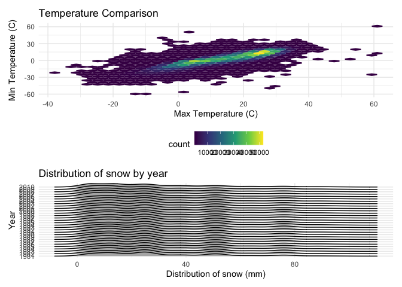

Data Science Homework 3
================
Kristina Howell

The following settings and libraries will be used throughout the
homework.

``` r
library(tidyverse)

knitr::opts_chunk$set(
  fig.width = 6, 
  fig.asp = .6, 
  out.width = "90%"
)

theme_set(theme_minimal() + theme(legend.position = "bottom"))

options(
  ggplot2.continuous.colour = "viridis", 
  ggplot2.continuous.fill = "virirdis"
)

scale_colour_discrete = scale_color_viridis_d
scale_fill_discrete = scale_fill_viridis_d
```

## Problem 1

Load the datasets from the p8105 library.

``` r
library(p8105.datasets)
data("instacart")
```

#### Dataset Description

The dataset **instacart** contains information about specific orders
from the instacart online grocery service with 1,384,617 observations
from 131,209 unique users. Key variables in the dataset include
*department*, *aisle*, *product\_name*, and *order\_id*, as well as
various entries representing time, day of week, and days since prior
order.

Overall, the dataset contains 1384617 rows and 15 columns. Each column
represents an individual item ordered from a user. For example, the
first 8 rows represent:

  - the *order\_id* 1
  - from *user\_id* 112108
  - includes items from *department* “dairy eggs”, “produce”, and
    “canned goods”
  - featuring *product\_name* “Bulgarian Yogurt” ( *product\_id*: 49302
    ) and *product\_name* “Organic Celery Hearts” ( *product\_id*: 10246
    )

The **complete list of variables** in the dataset is as follows:
order\_id, product\_id, add\_to\_cart\_order, reordered, user\_id,
eval\_set, order\_number, order\_dow, order\_hour\_of\_day,
days\_since\_prior\_order, product\_name, aisle\_id, department\_id,
aisle, department.

#### Problem 1 Questions

##### How many aisles are there, and which aisles are the most items ordered from?

The first code chunk identifies the total number of aisles: 134.

``` r
instacart %>% 
  summarize(n_aisle = n_distinct(aisle_id))
```

    ## # A tibble: 1 x 1
    ##   n_aisle
    ##     <int>
    ## 1     134

The second code chunk creates a tibble listing the aisles and how much
they’re ordered from.

``` r
instacart %>% 
  group_by(aisle) %>% 
  summarize(n_ordered = n()) %>% 
  mutate(aisle_rank = min_rank(desc(n_ordered))) 
```

    ## `summarise()` ungrouping output (override with `.groups` argument)

    ## # A tibble: 134 x 3
    ##    aisle                  n_ordered aisle_rank
    ##    <chr>                      <int>      <int>
    ##  1 air fresheners candles      1067        109
    ##  2 asian foods                 7007         53
    ##  3 baby accessories             306        132
    ##  4 baby bath body care          328        131
    ##  5 baby food formula          13198         26
    ##  6 bakery desserts             1501         99
    ##  7 baking ingredients         13088         27
    ##  8 baking supplies decor       1094        106
    ##  9 beauty                       287        134
    ## 10 beers coolers               1839         90
    ## # … with 124 more rows

##### plot that shows the number of items ordered in each aisle, limiting this to aisles with more than 10000 items ordered. Arrange aisles sensibly, and organize your plot so others can read it.

Continuing from the above code chunk,

``` r
instacart %>% 
  group_by(aisle) %>% 
  summarize(n_ordered = n()) %>% 
  mutate(aisle_rank = min_rank(desc(n_ordered))) %>% 
  filter(n_ordered >= 10000) %>% 
  ggplot(aes(x = aisle, y = n_ordered, color = aisle)) +
  geom_point()
```

    ## `summarise()` ungrouping output (override with `.groups` argument)



##### table showing the three most popular items in each of the aisles “baking ingredients”, “dog food care”, and “packaged vegetables fruits”. Include the number of times each item is ordered in your table.

////

##### table showing the mean hour of the day at which Pink Lady Apples and Coffee Ice Cream are ordered on each day of the week; format this table for human readers (i.e. produce a 2 x 7 table).

////

## Problem 2

Load in the dataset and tidy.

``` r
accel = read_csv("./data/accel_data.csv") %>% 
  janitor::clean_names() %>% 
  pivot_longer(
    activity_1:activity_1440,
    names_to = "time_minute",
    names_prefix = "activity_",
    values_to = "activity_count"
  ) %>% 
   mutate(
    week_day = case_when(
      day == "Monday" ~ "weekday", 
      day == "Tuesday" ~ "weekday", 
      day == "Wednesday" ~ "weekday", 
      day == "Thursday" ~ "weekday", 
      day == "Friday" ~ "weekday", 
      day == "Saturday" ~ "weekend",
      day == "Sunday" ~ "weekend",
      TRUE ~ ""
    ))
```

    ## Parsed with column specification:
    ## cols(
    ##   .default = col_double(),
    ##   day = col_character()
    ## )

    ## See spec(...) for full column specifications.

#### Dataset Description

#### Traditional Analyses

``` r
accel %>% 
  group_by(day_id) %>% 
  summarize(total_activity = sum(activity_count)) %>% 
  knitr::kable(digits = 1)
```

    ## `summarise()` ungrouping output (override with `.groups` argument)

| day\_id | total\_activity |
| ------: | --------------: |
|       1 |        480542.6 |
|       2 |         78828.1 |
|       3 |        376254.0 |
|       4 |        631105.0 |
|       5 |        355923.6 |
|       6 |        307094.2 |
|       7 |        340115.0 |
|       8 |        568839.0 |
|       9 |        295431.0 |
|      10 |        607175.0 |
|      11 |        422018.0 |
|      12 |        474048.0 |
|      13 |        423245.0 |
|      14 |        440962.0 |
|      15 |        467420.0 |
|      16 |        685910.0 |
|      17 |        382928.0 |
|      18 |        467052.0 |
|      19 |        371230.0 |
|      20 |        381507.0 |
|      21 |        468869.0 |
|      22 |        154049.0 |
|      23 |        409450.0 |
|      24 |          1440.0 |
|      25 |        260617.0 |
|      26 |        340291.0 |
|      27 |        319568.0 |
|      28 |        434460.0 |
|      29 |        620860.0 |
|      30 |        389080.0 |
|      31 |          1440.0 |
|      32 |        138421.0 |
|      33 |        549658.0 |
|      34 |        367824.0 |
|      35 |        445366.0 |

Idk trends?

#### Plot

``` r
accel %>% 
  group_by(day_id) %>% 
  summarize(total_activity = sum(activity_count)) %>% 
  ggplot(aes(x = day_id, y = total_activity)) +
  geom_point()
```

    ## `summarise()` ungrouping output (override with `.groups` argument)


## Problem 3

Load in the dataset and tidy.

``` r
library(p8105.datasets)
data("ny_noaa")
```
